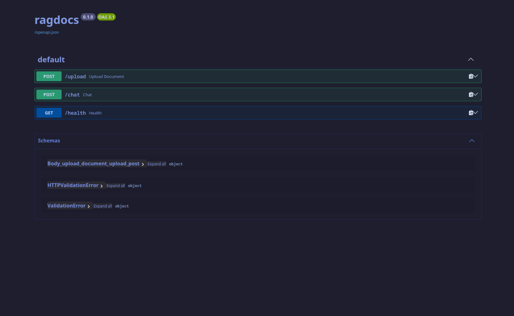
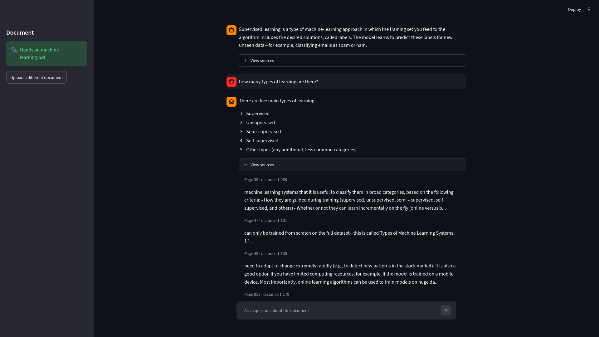

# ragdocs
A RAG (Retrieval-Augmented Generation) chatbot backend that ingests any PDF and
answers questions about it in natural language — grounded in the document's
actual content, with page-level source citations, instead of hallucinated
general knowledge.
Built to demonstrate backend and applied-AI skills together: FastAPI for the
API layer, a hand-rolled retrieval pipeline (no LangChain) for full control
over chunking/embedding/retrieval, Chroma as the vector store, and Groq for
fast, free-tier LLM inference — structured with a clean, modular architecture
(api/services/core) suitable for real-world use.

---
## Features
- Upload any PDF and ask natural-language questions about its content
- Retrieval-augmented answers — the LLM only answers from chunks actually retrieved from the document, and says "I don't know" when the answer isn't present
- Every answer includes page-level source citations with similarity scores
- Per-document isolation — each upload gets its own vector collection, so multiple documents never bleed into each other's answers
- Local embeddings (`sentence-transformers`) — no API cost or external call for the retrieval step
- Free-tier LLM inference via Groq — no OpenAI spend required to run or demo
- Input validation — rejects non-PDF uploads and unreadable (scanned/image-only) PDFs with clear error messages
- Graceful failure handling — clean errors instead of crashes if the backend is unreachable or a request times out
- Interactive, self-documenting API via Swagger UI
- Streamlit chat interface with persistent conversation history
---
## Project Structure
```
ragdocs/
│
├── app/
│   ├── api/
│   │   └── routes.py            # POST /upload, POST /chat
│   │
│   ├── core/
│   │   └── config.py            # environment/settings (pydantic-settings)
│   │
│   ├── services/
│   │   ├── ingestion.py         # PDF → text → overlapping chunks
│   │   ├── embeddings.py        # chunks → vectors (sentence-transformers)
│   │   ├── vectorstore.py       # Chroma storage + similarity search
│   │   └── llm.py               # prompt building + Groq inference
│   │
│   └── main.py                  # FastAPI app, health check
│
├── ui/
│   └── streamlit_app.py         # chat interface
│
├── data/
│   ├── uploads/                 # uploaded PDFs (gitignored)
│   └── chroma_db/               # persisted vector store (gitignored)
│
├── screenshots/
│   ├── swagger-docs.png
│   └── chat-interface.png
│
├── .env.example
├── .gitignore
├── requirements.txt
├── requirements.txt
├── LICENSE
└── README.md
```
---
## How It Works
1. **Ingestion** — the PDF is split page by page, then chunked into overlapping ~200-word segments so no sentence is lost at a chunk boundary
2. **Embedding** — each chunk is converted into a 384-dimensional vector locally via `sentence-transformers` (`all-MiniLM-L6-v2`) — no API call, runs on CPU
3. **Storage** — chunks and vectors are stored in a dedicated Chroma collection per document, keyed by a generated `document_id`
4. **Retrieval** — an incoming question is embedded the same way, and Chroma returns the 5 most semantically similar chunks
5. **Generation** — those chunks are inserted into a prompt instructing the LLM to answer *only* from that context, then sent to Groq for a fast, grounded response
---
## How to Run
**1. Clone the repo**
```bash
git clone https://github.com/maniesh-lab/ragdocs
cd ragdocs
```
**2. Create and activate a virtual environment**
```bash
python -m venv venv
source venv/bin/activate
```
**3. Install dependencies**
```bash
pip install -r requirements.txt
```
**4. Set up environment variables**
```bash
cp .env.example .env
```
Add a free Groq API key from [console.groq.com](https://console.groq.com) to `.env`.
**5. Start the backend**
```bash
uvicorn app.main:app --reload
```
**6. Start the UI** (in a separate terminal)
```bash
streamlit run ui/streamlit_app.py
```
**7. Try it out**
Visit `http://127.0.0.1:8501` for the chat interface, or `http://127.0.0.1:8000/docs` to test the API directly via Swagger UI.
---
## API Docs

---
## Example Request
```bash
curl -X POST "http://127.0.0.1:8000/upload" \
  -H "accept: application/json" \
  -H "Content-Type: multipart/form-data" \
  -F "file=@your_document.pdf;type=application/pdf"
```
```bash
curl -X POST "http://127.0.0.1:8000/chat?question=what+is+gradient+descent&document_id=YOUR_DOCUMENT_ID" \
  -H "accept: application/json"
```
## Example Response
```json
{
  "answer": "Gradient descent is a generic optimization algorithm that iteratively adjusts a model's parameters to minimize a cost function...",
  "sources": [
    {
      "text": "Gradient descent is a generic optimization algorithm capable of finding optimal solutions...",
      "source": "data/uploads/your_document.pdf",
      "page": 172,
      "distance": 0.803
    }
  ]
}
```

---
## Tech Stack
| Tool | Purpose |
|---|---|
| `fastapi` | API framework |
| `chromadb` | Local vector database |
| `sentence-transformers` | Local text embeddings |
| `groq` | LLM inference (free tier) |
| `streamlit` | Chat interface |
| `pypdf` | PDF text extraction |
| `pydantic-settings` | Configuration management |
---
## Use Case
Built for anyone who needs quick, grounded answers from a long document — a
manual, a textbook, a report — without manually searching through it page by
page. Upload once, ask as many questions as needed, get answers with sources
you can verify.

---
## Known Limitation
RAG retrieves a handful of relevant *chunks*, not the whole document at once.
This makes it strong at specific factual questions ("what is gradient
descent?") but structurally unable to answer whole-document questions like
"how many pages does this have?" or "which chapter is longest?" — no single
chunk contains that answer. The app is designed to say "I don't know" in these
cases rather than guess.

---
## Notes
- Non-PDF files are rejected with a `400` error
- Scanned/image-only PDFs (no extractable text) are rejected with a clear error message
- Each uploaded document is isolated in its own Chroma collection — multiple documents can be indexed without their content mixing in answers
- No LangChain — the chunking, embedding, and retrieval pipeline is hand-written for full understanding and control over each step
---
## Author
**Manish Pandeya** · [github.com/maniesh-lab](https://github.com/maniesh-lab)